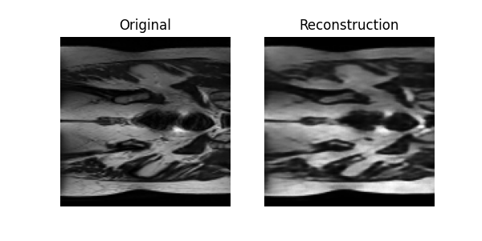
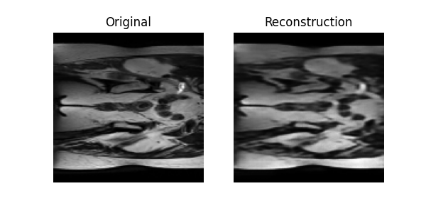
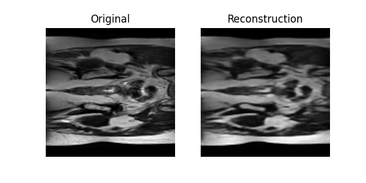
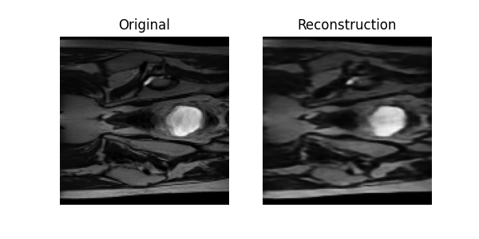
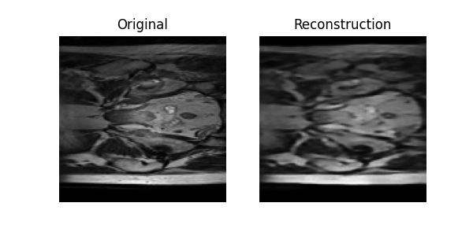
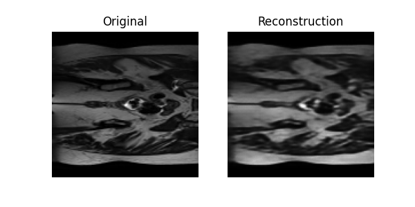

# Generative VQ-VAE Model for HipMRI Study on Prostate Cancer

## Contents
[Overview](#overview)\
[How It Works](#how-it-works)\
[File Structure](#file-structure)\
[Pre-processing](#pre-processing)\
[Data Splitting and Justification](#data-splitting-and-justification)\
[Results](#results)\
[Dependencies](#dependencies)\
[Usage](#usage)

---

## Overview
This project implements a **Vector Quantized Variational Autoencoder (VQ-VAE)** to model **2D prostate MRI slices** from the HipMRI Study on Prostate Cancer

The goal is to create a model capable of reconstructing realistic MRI images, achieving a **Structural Similarity Index (SSIM)** greater than **0.6**, with “reasonably clear” reconstructed images.

This model learns a **discrete latent representation** of MRI structures, a codebook of visual patterns, that can later be used for both **reconstruction** and **generation** of new realistic MRI-like images.

---

## The problem

In this project, we use a VQ-VAE to reconstruct 2D Hip MRI scans as part of a [MRI-alone radiation therapy study](https://data.csiro.au/collection/csiro:51392v2?redirected=true).

The goal was to reconstruct these images this and achieve an SSIM (Structual Similarity Index Measure) above 0.6. After testing, I decided to go with a model that aimed to achieve reconstructions with an SSIM above of 0.9 as the reconstructions at 0.6 were still rather blurry.

#### Why do we reconstruct these scans?
By training a VQ-VAE to reconstruct these scans, we force the model to learn meaningful latent representations of the anatomy.
Those representations capture:
- What typical tissue patterns look like
- What variations are normal vs. abnormal

Essentially, the model learns what a healthy or typical hip MRI looks like without explicit supervision.\

Once it has learned to accurately reconstruct these MRIs, we can sample from its latent space to generate new, realistic MRI-like images.

- These generated images can then be used as training data for diagnostic models or educational purposes
- Simulate variations in anatomy or disease presentation dependent on type of data it's trained on (regular or diseased)
- anonymize patient data by generating structurally realistic but non-identical scans.

In the context of this project title, we would use the generated images to form
a basis of what is a healthy Hip MRI scan looks like, and use them as a reference point to
identify prostate cancer in other real scans as part of a diagonistic tool.

This gives us a start to quantitatively identify prostate cancer from Hip MRI's.\
That being said, the tool that does this should only ever be used by 
professionals and should never be used as a be all and end all for decisions
on prostate cancer presence

---

## What is a VQVAE
A VQ-VAE (Vector Quantized Variational Autoencoder) uses vector quantization to map continuous latent representations into discrete embeddings.

Vector quantization (VQ) is a classical quantization technique from signal processing that allows the modeling of probability density functions


Ref: [VQVAE](https://huggingface.co/blog/ariG23498/understand-vq)

---

## How It Works
The implemented VQ-VAE follows three main components:

1. **Encoder:** Compresses input MRI slices into a lower-dimensional latent representation.  
2. **Vector Quantizer:** Maps continuous encoder outputs into discrete latent “codebook” entries.  
3. **Decoder:** Reconstructs images from quantized embeddings.

During training, the model minimizes:
- **Reconstruction loss (MSE)**: ensures pixel-level accuracy.
- **VQ loss:** ensures discrete latent codes stay close to encoder outputs.

After training, the decoder can generate *new* MRI-like samples by sampling from the learned codebook — making this a **generative** model.

---

## File Structure
``` bash
├── modules.py # Model architecture (Encoder, Decoder, VectorQuantizer, VQVAE)
├── dataset.py # Data loader and preprocessing for MRI slices
├── train.py # Training, validation, plotting of metrics
├── predict.py # Reconstruction and SSIM evaluation
├── README.md # Documentation (this file)
└── outputs/
    ├── train_output.txt # Output of what train.py prints when it runs. Shows epoch training and losses
    ├── training_plots.png #plots generated during training, showing loss and SSIM scores over epochs
    └── predict_output/
        └── ... # Folder with predict.py outputs. example reconstructions
```

---

## Pre-processing
All `.nii.gz` MRI volumes are loaded using **NiBabel** and split into individual 2D slices.  
Preprocessing includes:
- Intensity normalization to `[0, 1]`
- Percentile clipping (1st–99th percentile)
- Resizing to `(128 × 128)` pixels using bilinear interpolation (This resizing is technically done when the slice is requested from the HipMRISlicesDataset datatype as defined in its \_\_getitem__)
- Conversion to single-channel tensors

These steps stabilize training and reduce sensitivity to MRI contrast differences across scans.


---

## Data Splitting and Justification
The dataset includes  `train`, `test` and `validate` folders\
So, each folder is used for its repective purpose in training (`train` and `validate`) or testing (`test`)

- **Training set:** `keras_slices_train`  
- **Validation set:** `keras_slices_validate`  
- **Testing set:** `keras_slices_test`


---

## Results
Below are six example reconstructions using a model that trained for 10 epochs that achieved an SSIM of 0.9007 durin its training

 \
Reconstructions with SSIM of 0.892 (left) and 0.912 (right)


 \
Reconstructions with SSIM of 0.901 (left) and 0.896 (right)


 \
Reconstructions with SSIM of 0.870 (left) and 0.904 (right)


---
## Dependencies
| Library | Version (tested) | Purpose |
|----------|------------------|----------|
| `torch` | ≥2.0 | Deep learning framework |
| `torchvision` | ≥0.15 | Image utilities |
| `nibabel` | ≥5.1 | MRI data loading |
| `scikit-image` | ≥0.22 | SSIM computation |
| `numpy` | ≥1.24 | Array operations |
| `matplotlib` | ≥3.7 | Plotting losses |
| `tqdm` | ≥4.66 | Progress bars |

## Usage
To run this, you need to first make sure all the above libraries are installed as some are not standard. This can be done via the following in your terminal:
```bash
pip install torch torchvision nibabel scikit-image matplotlib tqdm
```
You should then set up the data. The data is assumed to be placed in the following structure:
``` bash
├── modules.py
├── dataset.py 
├── train.py
├── predict.py 
├── README.md
├── outputs/
└── HipMRI_Study_open/             #
    └── keras_slices_data/         #
        ├── keras_slices_test/     #
        ├── keras_slices_validate/ #
        └── keras_slices_train/    #

```
Where each keras_slices_* folder holds the respective .nii.gz files representing the 2d scans

The following should be run in the terminal, within the folder the files themselves reside. Or  with the relative or absolute path from wherever you are, to the file

You must then run train.py:
```bash
python train.py
```
This will train a model with a max of 50 epochs, stopping only when either 50
 epochs is reached or the set target SSIM is reached. Which is currently set 
 at 0.9. This file will make and save the model and some plots to a folder 
 called checkpoints. the folder will hold the following:
``` bash
└── checkpoints/
    ├── history.pth # Training history of train and validate loss and SSIM scores
    ├── vqvae_best.pth # Version of model with best SSIM score. Checked after each epoch 
    ├── vqvae_final.pth # Last version of model. Typically the same as vqvae_best as more training gave better SSIM, but these could differ at higher epochs 
    └── training_plots.png # Plots of train and validate losses against epochs and SSIM scores against epochs
```
This file will also print to standard out the progression of the training in 
epochs with information about its losses and SSIM scores. This output can be found in the outputs folder, in the file [train_output.txt](outputs/train_output.txt)

Finally, predict.py is then run  :
```bash
python predict.py
```
This then creates a predict_output folder and saves example reconstruction
 figures. In the format of the orignal next to the reconstruction.
  With the SSIM score in the name of the file in the format `example_{i}_SSIM_{SSIM score}.png`